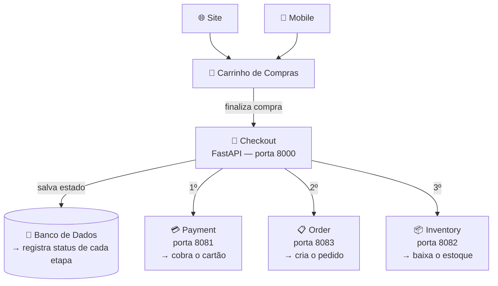

# Checkout Commerce — Arquitetura

## Como nasceu este projeto

Um e-commerce tem várias partes: o **Site** e o **Mobile** onde o cliente navega e monta o **Carrinho de Compras**. Ao finalizar a compra, o carrinho dispara o **Checkout** — que é o coração do sistema. O Checkout não faz tudo sozinho: ele orquestra três microsserviços independentes, cada um com sua responsabilidade.



## Ciclo de vida do Checkout no banco

Cada etapa é registrada — se algo falhar, sabemos exatamente onde parou:

```
PENDING → PROCESSING_PAYMENT → PROCESSING_INVENTORY → CREATING_ORDER → SUCCESS
                                                                       ↘ FAILED
```

## Por que cada peça existe?

| Componente | Por que existe |
|---|---|
| **FastAPI** | Recebe as requisições HTTP e roteia para a função certa |
| **Pydantic** | Valida os dados automaticamente — campo errado ou faltando = erro 422 sem código extra |
| **router.py** | Separa as rotas do `main.py` — cada módulo cuida das suas próprias rotas |
| **checkout_process.py** | Orquestra a lógica: chama pagamento, estoque e pedido na ordem certa |
| **checkout_model.py** | Representa o Checkout no banco — registra status e onde falhou |
| **WireMock** | Simula os microsserviços reais para desenvolvimento e testes sem subir sistemas externos |
| **Docker** | Roda o WireMock de forma isolada e reproduzível em qualquer máquina |
