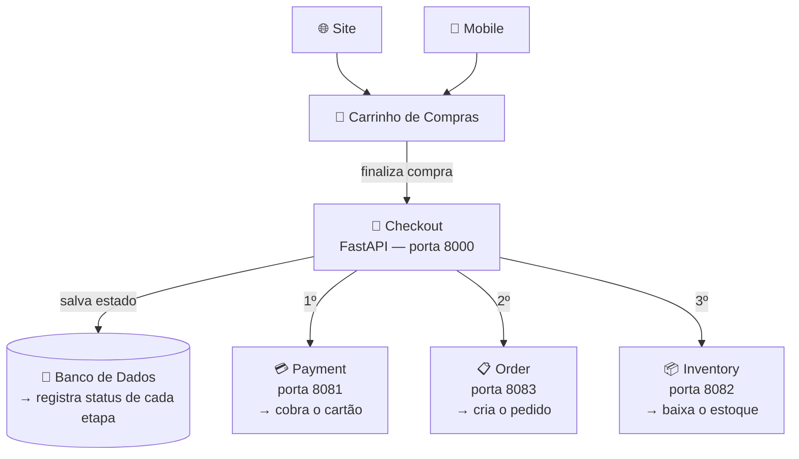

# Checkout Commerce API

Estudo de microsserviços com **FastAPI**, **WireMock** e **Docker**.  
O projeto simula o fluxo completo de um checkout de e-commerce, orquestrando serviços de pagamento, estoque e pedido.

---

## Como nasceu este projeto

Um e-commerce tem várias partes: o **Site** e o **Mobile** onde o cliente navega e monta o **Carrinho de Compras**. Ao finalizar a compra, o carrinho dispara o **Checkout** — que é o coração do sistema. O Checkout não faz tudo sozinho: ele orquestra três microsserviços independentes, cada um com sua responsabilidade.



> O diagrama completo com arquitetura e sequência de chamadas está em [`architecture.drawio`](architecture.drawio).  
> Abra com a extensão **Draw.io Integration** no VS Code ou em [app.diagrams.net](https://app.diagrams.net).

---

## Ciclo de vida do Checkout

Cada etapa é persistida no banco — se algo falhar, sabemos exatamente onde parou:

```
PENDING → PROCESSING_PAYMENT → PROCESSING_INVENTORY → CREATING_ORDER → SUCCESS
                                                                       ↘ FAILED
```

---

## Stack

| Tecnologia | Papel |
|---|---|
| **FastAPI** | Framework web — recebe e roteia as requisições HTTP |
| **Pydantic** | Valida os dados automaticamente (campo inválido = erro 422) |
| **SQLAlchemy + asyncpg** | ORM assíncrono para persistência no PostgreSQL |
| **WireMock** | Simula os microsserviços externos durante o desenvolvimento |
| **PostgreSQL** | Banco de dados relacional — persiste o estado de cada checkout |
| **Docker** | Sobe o PostgreSQL e os serviços WireMock de forma isolada e reproduzível |
| **uv** | Gerenciador de dependências Python |

---

## Estrutura do projeto

```
app/
├── main.py                   # Ponto de entrada — lifespan cria as tabelas na startup
├── checkout/
│   ├── router.py             # Rotas do checkout (POST /checkout/process)
│   ├── checkout_process.py   # Orquestra as chamadas aos microsserviços
│   ├── checkout_request.py   # Modelos de entrada (Pydantic)
│   └── checkout_model.py     # Modelo do banco (SQLAlchemy) + enum de status
└── infra/
    └── dabase.py             # Engine async, sessão e create_tables()

wiremock/
├── payment/mappings/         # Mock do serviço de pagamento (porta 8081)
├── inventory/mappings/       # Mock do serviço de estoque (porta 8082)
└── order/mappings/           # Mock do serviço de pedidos (porta 8083)
```

---

## Como rodar

### 1. Suba o PostgreSQL e os serviços WireMock

```bash
docker compose up -d
```

> O PostgreSQL sobe na porta `5442` e o banco `checkout_db` é criado automaticamente.  
> As tabelas são criadas pela própria aplicação na startup (via `lifespan`).

### 2. Configure o ambiente

```bash
cp .env.example .env
# edite o .env com suas configurações
```

### 3. Instale as dependências

```bash
uv sync
```

### 4. Suba a API

```bash
uv run python app/main.py
```

A API estará disponível em `http://localhost:8085`.  
Documentação automática: `http://localhost:8085/docs`

---

## Testando os endpoints

Use o arquivo [`request.http`](request.http) com a extensão **REST Client** do VS Code ou execute via curl:

```bash
# Health check
curl http://localhost:8085/health

# Processar checkout
curl -X POST http://localhost:8081/payments/process \
  -H "Content-Type: application/json" \
  -d '{"amount": 1000.01, "currency": "BRL"}'
```

---

## Por que cada peça existe?

| Componente | Por que existe |
|---|---|
| **router.py** | Separa as rotas do `main.py` — cada módulo cuida das suas próprias rotas |
| **checkout_process.py** | Orquestra a lógica: chama pagamento, estoque e pedido na ordem certa |
| **checkout_model.py** | Representa o Checkout no banco — registra status e onde falhou |
| **lifespan (main.py)** | Evento de startup do FastAPI — garante que as tabelas existem antes de receber requisições |
| **create_tables (dabase.py)** | Cria as tabelas via SQLAlchemy sem precisar rodar migrations manualmente |
| **WireMock** | Permite desenvolver sem depender de sistemas externos reais |
| **Docker** | Garante que o banco e os mocks rodam igual em qualquer máquina |
